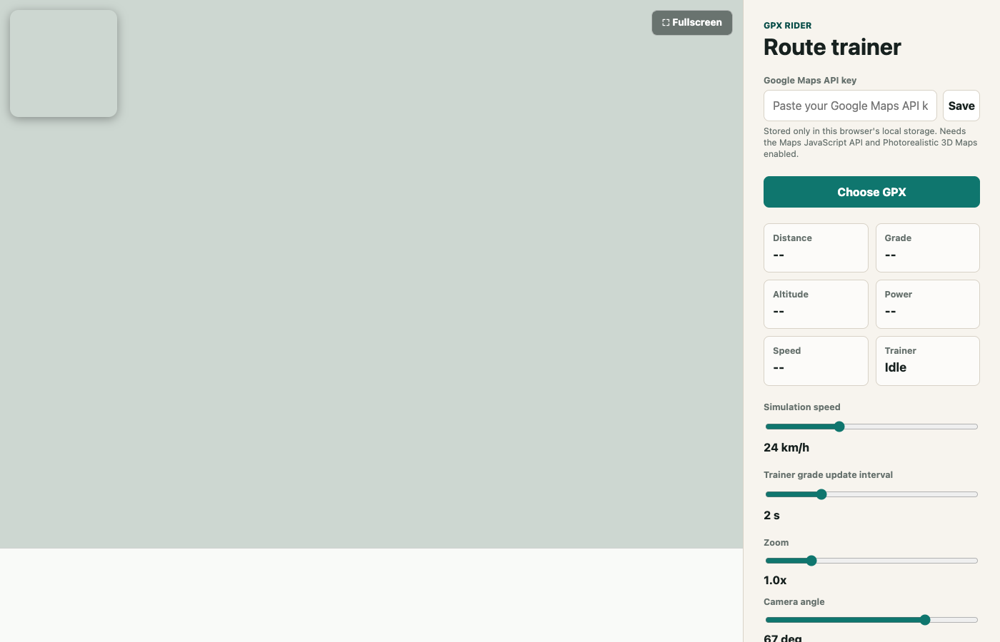

# GPX Rider

**A free, open-source, browser-based virtual cycling trainer.** Load any GPX
route, ride it on photorealistic 3D satellite terrain, and drive real grade
changes on a Bluetooth smart trainer — no app install, no subscription, no
account.

[](LICENSE)
[](https://github.com/ziizii/gpx-rider/actions/workflows/deploy-pages.yml)

**[Try the live demo →](https://ziizii.github.io/gpx-rider/)**
(runs entirely in your browser — bring your own free Google Maps API key)



## Why GPX Rider?

Zwift, TrainerRoad, and RGT are great, but they're closed platforms with
subscriptions, fixed worlds, and no way to just point at *your* GPX file and
ride it on the actual terrain. GPX Rider is the opposite: a small,
hackable, static web app that

- turns any **GPX route** into a live indoor ride on **real photorealistic 3D
  satellite imagery** (Google Photorealistic 3D Maps),
- sends real **grade/slope changes** to your **Bluetooth FTMS smart
  trainer** (e.g. Wahoo KICKR) as you progress along the route,
- runs as a **static site with zero backend** — clone it, open it, ride,
- and is **free and MIT-licensed**, so you can fork it, self-host it, or
  send a PR.

If that sounds useful, contributions are very welcome — see
[Contributing](#contributing) below.

## Features

- 📍 **GPX import** — drag in any route with track points and elevation.
- 🛰️ **Photorealistic 3D map** — a forward-facing follow camera tracks your
  position and heading along the route, with a satellite minimap overlay.
- 🚴 **Bluetooth FTMS trainer control** — connects to Wahoo KICKR and other
  FTMS-compatible trainers over Web Bluetooth and pushes live simulation
  grade as you ride.
- 📈 **Live stats & elevation profile** — distance, grade, altitude, power,
  and speed, plus a full-route elevation chart.
- 🖥️ **Fullscreen ride HUD** — a distraction-free overlay for pairing with a
  smart TV or tablet on the handlebars.
- 🔑 **Bring your own API key** — your Google Maps key is typed into the app
  and saved only in your browser's `localStorage`; it's never sent anywhere
  but Google.
- 💾 **Remembers your session** — last route, ride progress, fallback speed,
  camera settings, and previously paired trainer all persist locally.
- 🧩 **No build step** — plain HTML/CSS/JS ES modules, no bundler, no
  framework, no `node_modules` to run it.

## Quickstart

```sh
git clone https://github.com/ziizii/gpx-rider.git
cd gpx-rider
make run
```

Then open the printed URL in **Chrome or Edge on macOS** (Safari doesn't
support Web Bluetooth, so it can't talk to a trainer) and paste in a free
[Google Maps API key](https://developers.google.com/maps/documentation/javascript/get-api-key)
when prompted.

Run the unit tests with:

```sh
make test
```

## How to use it

1. Open the page in Chrome and paste in your Google Maps API key (saved
   locally, one-time setup).
2. Choose a GPX file with track points and elevation.
3. Click `Connect KICKR`, select your trainer, then hit `Start`.
4. GPX Rider converts local route grade into FTMS indoor-bike simulation
   parameters in real time.
5. Once the trainer reports FTMS Indoor Bike Data, the app shows live power
   and speed and uses trainer speed to advance you along the route.
6. The map follows the route with a forward-facing camera based on GPX
   bearing; tune `Zoom`, `Camera angle`, and `Camera behind` to taste —
   those settings are remembered locally.

## Hosting your own copy

The `app/` folder is a fully static site — no server-side code at all — so
it can be hosted anywhere that serves static files (GitHub Pages, Netlify,
Vercel, S3, or just a laptop on your home network). This repo ships a
GitHub Actions workflow ([.github/workflows/deploy-pages.yml](.github/workflows/deploy-pages.yml))
that deploys `app/` to GitHub Pages automatically on every push to `main`.
To turn it on for your fork: **Settings → Pages → Source: GitHub Actions**.

Because the Google Maps key is entered per-visitor and stored in their own
browser, you can publish a live demo without ever exposing a key of your
own.

## Notes & limitations

- The app prefers Google Photorealistic 3D Maps; enable the **Maps
  JavaScript API** and the **Photorealistic 3D Maps** feature for your
  Google Cloud project, or the map fails to load instead of falling back to
  another renderer.
- Route and ride progress are stored in browser `localStorage`. Very large
  GPX files may exceed browser storage limits.
- Trainer reconnect relies on Chrome's remembered Web Bluetooth devices. If
  Chrome doesn't expose the saved device, click `Connect KICKR` again.
- Target hardware is FTMS-compatible trainers (e.g. Wahoo KICKR). Older
  firmware or proprietary-only control paths may need trainer-specific
  protocol work.
- Rider and bike weight are normally configured in the trainer ecosystem
  rather than sent with the FTMS grade command; this app currently sends
  slope, wind, rolling resistance, and drag-area values.
- This is a young project. Test resistance changes at low speed and keep
  the bike/trainer clear before a real workout.

## Contributing

This is an early-stage prototype and could use help in a lot of directions:
more trainer protocols, a non-Google map renderer option, route
libraries/import from Strava or Komoot, better mobile support, tests,
docs, or just bug reports from riding it. Issues and PRs are welcome —
open an issue to discuss anything nontrivial before diving into a big
change.

## License

[MIT](LICENSE)
